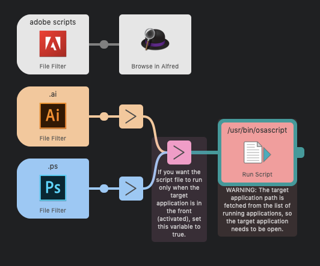

# Photoshop & Illustrator Script Launcher (Alfred Workflow)



This workflow uses Alfred's built in `File filter` input and as such I haven't actually done much to put together this workflow. This is more just a wake-up call to anyone who isn't already doing this. 

## Usage

1. Open Alfred (I use `Ctrl+Space`)
2. Type in `.ps` or `.ai` and after that any following characters you type in does a fuzzy search for `.js` and `.jsx` files in the specified scopes.
3. Pressing `Enter` will open the file
		- Cmd+Enter will open the file in Finder.

## Photoshop Example

[Link to gif](https://github.com/joonaspaakko/Photoshop-Illustrator-Script-Launcher-Using-Alfred/blob/master/photoshop-example.gif?raw=true)


## Illustator Example

[Link to gif](https://github.com/joonaspaakko/Photoshop-Illustrator-Script-Launcher-Using-Alfred/blob/master/illustrator-example.gif?raw=true)


## Default Scopes for the search

By default you need to put your `.js` and `.jsx` script files in there folders for the search to work:

- `~/Dropbox/Adobe scripts/Illustrator`
- `~/Dropbox/Adobe scripts/Photoshop`
- `~/Dropbox/Adobe scripts/PS & AI` — _Scripts put in this folder are searchable with both of the prefixes: `.ai` and `.ps`_

The adobe scripts file filter searches scripts from anywhere inside `~/Dropbox/Adobe scripts/"`

> `~` is equivalent to `/Users/current_username/`

You can change these folders by double clicking the file filter and then dragging new folders in the "Scope" tab. Delete old paths with backspace.


## Why I think this is great way to launch scripts in PS and AI

- **I can search for scripts**, which is just amazing. I just need to remember the script name or part of the name because Alfred does a fuzzy search. Which I'd argue is way better than remembering bunch of arbitrary shortcuts.

- **Alfred has a Dropbox sync**, so as long as I install Dropbox and Alfred on a new computer, I can always regain access to script filters and script hotkeys that I've made with Alfred.

- **Installing new scripts is really simple.** All I have to do is just add script files into the specified Dropbox folders and they are ready to be used.

- **Editing scripts on a whim is simple.** If you open a script file with `cmd` pressed, the file is shown in finder. From there you can open it in your code editor of choice. Alternatively, you can also use [file actions](file-action-example.gif): With a file selected in Alfred, tap either `fn` or `ctrl` once and then you can for example do action `open with... {the application of your choice}`.


- **Alfred will sort the query results based on usage.** This basically means that with a specific query that returns multiple results, the scripts you've used the most float to the top.

- **Alfred also has `keyword` and `hotkey` triggers.** I use `File filter` in this workflow, but with the Dropbox sync, it makes sense to set `hotkey` triggers through Alfred as well. That said, I believe I use `File filter` like 90% of the time.

____
____

## Applescript

This is the script used in the Alfred workflow, though some things are changed so it works outside of Alfred.

```js
set appName to "Adobe Photoshop"
set frontMostVar to false --Set true and the scripts are triggered only if the target app is active
set scriptFile to POSIX file "/Users/joonaspaakko/Documents/PS scripts.jsx"

tell application "System Events"
	set targetApp to application file of (first application process whose name contains appName)
	set appPath to path of targetApp
	set appName to name of targetApp
end tell

if frontMostVar is true then
	if application appName is frontmost then
		tell application "Finder"
			open scriptFile using appPath
		end tell
	end if
else
	tell application "Finder"
		open scriptFile using appPath
	end tell
end if
```

...and just for good measure, here's a more compact version without any bells and whistles. Most importantly in this script I'm using a static variable for the application path. Over the years I changed this workflow to get the app path automatically (like in the script above) because even in CC, the application path changes every year and it's really annoying to go around changing little things in workflows/scripts due to application changes.

```js
set appPath to POSIX file "/Applications/Adobe Photoshop CC 2019/Adobe Photoshop CC 2019.app"
set scriptFile to POSIX file "/Users/joonaspaakko/Documents/PS scripts.jsx"

tell application "Finder"
	open scriptFile using appPath
end tell
```