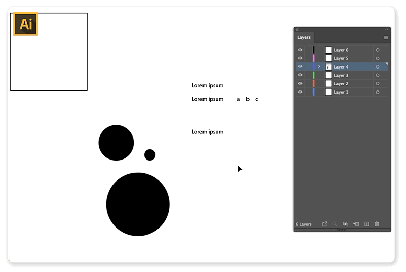

# Photoshop & Illustrator Script Launcher (Alfred Workflow)

This workflow uses Alfred's built in `File filter` input and as such I haven't actually done much to put together this workflow. This is more just a wake-up call to anyone who isn't doing this.

## Usage

1. Open Alfred (I use `Ctrl+Space`)
2. Type in `.ps` or `.ai` and after that any following characters you type in does a fuzzy search for `.js` and `.jsx` files in the specified scopes.

## Photoshop Example

## Illustator Example

## Search Scopes??

The way the script filter works is it searches the defined file types from the defined scope.

In this case the file types are `.js` and `.jsx`.

### Default Scopes

By default the scripts need to be in these folders to work:

- ~/Dropbox/Adobe scripts/Illustrator
- ~/Dropbox/Adobe scripts/Photoshop
- ~/Dropbox/Adobe scripts/PS & AI

> ~ is equivalent to /Users/your_username/

You can change these folders by just double clicking the file filter and then dragging new folders in the "Scope" tab. Delete old paths with backspace.

> The adobe scripts file filter searches scripts from anywhere inside "/Users/joonaspaakko/Dropbox/Adobe scripts/"

## Why I think this is great way to launch scripts in PS and AI

- I can search for scripts, which is just amazing.
- All I have to do is just add script files into the specified Dropbox folders and the scripts are ready to be used
	- It's super easy to test new scripts and in general setup scripts... since there is no setup: Just add scripts to the folder, search with Alfred and run
	- It's a little more work to add hotkeys to launch scripts, although that has its uses too.
- I just need to remember the script name or part of the name because Alfred does fuzzy search. It's just so convenient
- Alfred will sort the query results based on usage. This basically means that with a specific query that return multiple results, the most triggered scripts float to the top.
- Alfred has a Dropbox sync, so as long as I install Dropbox and Alfred, I can always regain access to my script filters and shortcuts that I've made with Alfred. In that sense it is pretty crucial that the scripts are stored inside the Dropbox folder as well.
- Alfred has 3 triggers that are useful with PS and AI: `keyword`, `hotkey`, and `File filter`
	- `File filter` is the one that this workflow uses but with the dropbox sync, it makes sense to set hotkey triggers through Alfred as well. Although I believe I use `File filter` like 90% of the time. It's just easier to remember than like 20 arbitrary hotkeys.
